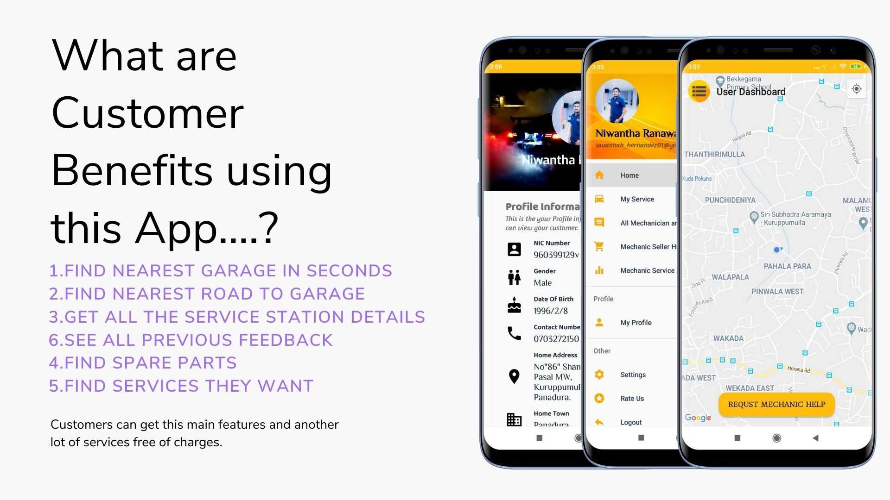

# My Mechanic App (Android Application)

## Introduction of Application

      <body>
            Today, a vehicle is becoming an integral part of a home. Many people in Sri Lanka are now using personal vehicles to save time and for their convenience. Due to this, 
            the number of vehicles on the road is increasing. As a result, the number of vehicle service stations is increasing exponentially. Despite the increase in the number 
            of workstations, no classification or grading system exists. Customers are not yet able to find out the quality of these service stations. Further, in Sri Lanka, there
            is no mechanism to find the nearest service point in case of a breakdown. What is still being done is inquiring about the nearest service station from a nearby person.
            This cannot be considered a practical method. This can be even more difficult at night or when you are faced with such an incident outside your living area. Here you 
            will have to inquire several people to get some information. Finally, if you have found a place, it is difficult to find the location, phone number or any other 
            information about it.
      </body>
               
      <body>
            This mobile app can be used as a remedy. This enables the user to locate the workstation closest to where the user is located. You can also see the telephone numbers,
            open hours and other information at the service station. Also, the customer will be able to see the feedback received by people who have previously worked through the 
            service station. This will help you find the right place to do your work. You can also make sure that the service station can get the quality of service that you 
            expect. It also makes it easy to see through the app the location of the service station and the shortest way to reach it. The technician can see where his client is. 
            If necessary, the mechanic can find the way to get to the customer's location. (Only if you go to the break down place and serve) This app makes it easy for the 
            customer to pay the technician. This will enable the customer to solve the problems caused by the money. Therefore, you can find a solution to your financial need in 
            the event of an emergency breakdown.
      </body>
               
      <body>
            This enables the technician to disseminate information about his service station to all users. No need to spend money on this. As an additional service, technicians 
            can offer the services and information provided by their workplace. If you have any spare parts you can use this app to sell it. You can disseminate information at your 
            workstation to more people at no cost. Another advantage is that the technician can view the services and prices of other technicians. It also helps control the price of 
            some services.
      </body>
      

## Used Technologies

         <body>Used Technologies and Services.</body>
     

       <ul>
           <li>Android Studio</li>
           <li>Firebase Database</li>
           <li>Firebase Authentication</li>
           <li>Firebase Storage</li>
           <li>GeoFire</li>
           <li>Circular Image View</li>
           <li>Google Map</li>
           <li>Picasso</li>
           <li>Regex Validation (Validate User Input)</li>
           <li>Decimal to Hexa decimal</li>
       </ul>
    

# Application Functions and Plans

## Besic Functions
 <body>User Functions.</body>
     

       <ul>
           <li>Create Accout</li>
           <li>Password Reset Option</li>
           <li>Call Emergency Repair Service</li>
           <li>Give Feedback / View Feedback</li>
           <li>Add spare-parts post / view spare-part post</li>
           <li>Add service post / view service post</li>
           <li>User Edit User Details</li>
           <li>Change Shop Profile</li>
           <li>Change Profile Picture</li>
           <li>Change Shop Profile Picture</li>
           <li>Change Password</li>
           <li>Change Email</li>
           <li>Delete Account</li>
           <li>Change shop location</li>
       </ul>
     

     
## UML Class Diagrams
     
  

## Use Case Diagrams
     
  

## DFD (Level 1) Diagrams
     
  

## UI Desings

  #### Login Interface
  
  
   

   
  
   

  
     
